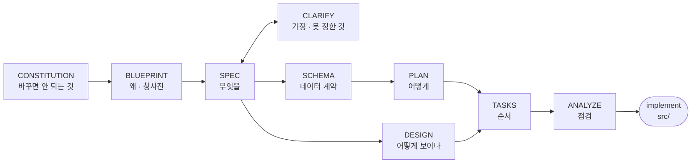

# 00-START: 이 레포를 처음 여는 AI가 읽는 문서

크로노아틀라스는 **온톨로지가 중심인 역사 지도·관계 그래프·타임라인**이다. 연도 하나(URL `?y=`)가 네 뷰를 동시에 움직인다. 산스 인생책 편데의 『로마제국쇠망사』 시즌용으로 만들었고, 데이터셋만 바꾸면 다른 책·시대에도 쓴다. 소비자는 사람(브라우저)과 AI(MCP) 둘이다.

- **라이브** <https://snas-lifebook.github.io/chronoatlas/>
- **원격** `snas-lifebook/chronoatlas` (public)
- **로컬** 이 레포

## 먼저 알아야 할 것: 2026-09-16에 문서가 합쳐졌다

그전까지 이 프로젝트는 **문서가 두 곳에 갈라져 있었다.** 코드와 요구 원장은 레포에, 설계 근거(헌장·명세·스키마·디자인·작업 순서)는 Obsidian 볼트에 있었다. 그래서 레포만 열면 「왜 이렇게 만드는가」의 절반을 볼 수 없었다.

**지금은 전부 이 레포에 있다.** 옛 문장이 「볼트 `Works/비주얼파이프라인/`이 정본이다」라고 말하면 **그 문장이 낡은 것이다.** 이관된 문서는 머리에 `> 볼트 …에서 이관 (2026-09-16)` 한 줄이 붙어 있다.

볼트 `Works/크로노아틀라스/`에 일부러 남긴 것은 넷이고, 넷 다 이 레포에서 작업하는 데 필요하지 않다.

| 볼트에 남은 것 | 왜 |
|---|---|
| `Context/` 4건 | River가 실제로 친 프롬프트 원문·배경. **공개 레포에 올릴 것이 아니다** |
| `assets/ref/` 2.7MB · `assets/베이스맵_토탈워고지도/` 6.9MB · `references/캡처라이브러리/` 74파일 10MB | **제3자 자산.** 타 제품 화면 캡처와 상용 게임 자산이라 재배포하지 않는다 (CONSTITUTION 8-2 「상용 게임 자산은 내부 레퍼런스다, 파일은 나가지 않는다」) |
| `assets/`의 자체 제작 바이너리 약 6MB (phase0 git bundle · 시연 mp4 2본 · 목업 HTML 2본 · 예시 PNG 2장) | 우리 것이라 라이선스 문제는 없다. 다만 **바이너리**고, 공개 레포를 불릴 값이 없다. 필요하면 볼트에서 꺼내 쓴다 |
| 편데 프로젝트 맥락 (발표 회차·팀 운영·회차별 산출물) | 이 레포의 관심사가 아니다 |

**설계 문서 22개(SDD 11종 + 기각 근거 1 + `research/` 9 + `history/` 1)가 전부 이 `docs/`에 있다.** 2026-09-16에 볼트를 78파일 전수로 훑어 더 옮길 것이 없음을 확인했다.

## 읽는 순서

**최소 경로 넷.** 이것만 읽고 시작해도 된다.

1. **이 문서** (지금 보는 것) — 지도
2. [`CONSTITUTION.md`](CONSTITUTION.md) — **규칙. 다른 모든 것보다 위다.** 특히 「AI는 정본에 직접 쓰지 않는다」와 「지어내지 않는다」
3. [`HANDOFF.md`](HANDOFF.md) — 지금 어디까지 됐나, 환경 함정, 지금 집을 수 있는 것
4. [`../AGENTS.md`](../AGENTS.md) — 빌드·구조·MCP·하지 말 것

그 다음 `npm i && npm run build`가 초록인지 확인하고 시작한다.

**무엇을 할지 고를 때는** [`BACKLOG.md`](BACKLOG.md) 「지금 순서」에서 고른다. `SPEC.md`의 F 목록 순서가 아니다. F는 *무엇을 만들었나*이고 R은 *River가 무엇을 요구했나*다. **F를 따라가면 이미 잘 되는 것에 계속 붓게 된다** (2026-09-10에 실제로 그랬다).

**갈래별로 더 읽을 것.**

| 무엇을 이어받는가 | 먼저 읽을 것 |
|---|---|
| Claude 계열이 아닌 에이전트로 처음 들어왔다 | [`HANDOFF-GPT.md`](HANDOFF-GPT.md) §3 용어 · §4 못 하는 일 · §6 관례 |
| 2회차 발표 「카이사르 팩」 슬라이스 | [`PACK-CAESAR.md`](PACK-CAESAR.md) §0. 이 슬라이스는 그쪽이 작업 정본이다 |
| 지도 범위를 바꾼다 | [`RUNBOOK-extent.md`](RUNBOOK-extent.md). **River 터미널 실행이 필요하다** |
| 특정 지도 주제 | 아래 「지도 주제 정본」 표 |
| 왜 이 설계인가가 궁금하다 | [`DESIGN.md`](DESIGN.md) 반려조건 P1~P17 → [`BLUEPRINT.md`](BLUEPRINT.md) |

## 문서 지도

문서가 이 모양인 이유는 **SDD(명세 주도 개발) 흐름**을 따르기 때문이다. 왼쪽이 오른쪽의 근거다.

**계약과 명세** (이 넷이 「무엇을 만드는가」를 정한다)

| 문서 | 무엇 |
|---|---|
| [`CONSTITUTION.md`](CONSTITUTION.md) | 규칙. 최상위 |
| [`SPEC.md`](SPEC.md) | 기능 F1~F29 + 상태 |
| [`SCHEMA.md`](SCHEMA.md) | 온톨로지 스키마 |
| [`DESIGN.md`](DESIGN.md) | 디자인 반려조건 P1~P17 |

**요구와 진행**

| 문서 | 무엇 |
|---|---|
| [`BACKLOG.md`](BACKLOG.md) | **요구 정본.** R01~R45, 라운드 A~H, 「지금 순서」 |
| [`REQUESTS.md`](REQUESTS.md) | River 요청 **원문. 요약하지 않는다** (요약이 원인을 지운 일이 여러 번 있었다) |
| [`TASKS.md`](TASKS.md) | 작업 단위 Phase·라운드 |
| [`HANDOFF.md`](HANDOFF.md) | 현재 상태 스냅샷 |
| [`HANDOFF-GPT.md`](HANDOFF-GPT.md) | 용어·관례·에이전트가 못 하는 일 |
| [`PACK-CAESAR.md`](PACK-CAESAR.md) | 2026-09-13 발표 팩 슬라이스 정본 |

**지도 주제 정본** (각 주제의 좌표·수치·출처가 여기 있다. 지어내지 말고 여기서 가져온다)

| 문서 | 주제 |
|---|---|
| [`ALESIA.md`](ALESIA.md) · [`ALEXANDRIA.md`](ALEXANDRIA.md) · [`ROMA-URBS.md`](ROMA-URBS.md) | 미시 지도 세 장 |
| [`MICROMAP-BASEMAP.md`](MICROMAP-BASEMAP.md) · [`MICROMAP-UX.md`](MICROMAP-UX.md) | 미시 지도 바탕 도판·UX |
| [`LEGIONS.md`](LEGIONS.md) · [`PEOPLES.md`](PEOPLES.md) · [`PLAINS.md`](PLAINS.md) | 군단 · 주변 민족 · 평야·곡창 |
| [`POLITY-LABELS.md`](POLITY-LABELS.md) | 정치체 이름표 |

**절차**: [`RUNBOOK-extent.md`](RUNBOOK-extent.md) 범위 바꾸기

**설계 단계 산물** (2026-08~09 초기. 결론은 위 명세에 흡수됐고, 여기는 *왜 그 결론이 나왔나*가 있다)
[`PLAN.md`](PLAN.md) · [`BLUEPRINT.md`](BLUEPRINT.md) · [`ANALYZE.md`](ANALYZE.md) · [`CLARIFY.md`](CLARIFY.md) · [`RESEARCH.md`](RESEARCH.md) · [`TOOLING.md`](TOOLING.md) · [`roadmap.md`](roadmap.md)

**[`research/`](research/)** 선행 조사 9건 (3D 시각화·게임 데이터모델·선행 플랫폼·저장질의 MCP·지형기후해류·시각 레퍼런스·AI 플랫폼·레퍼런스 통합표·쇠망사 레퍼런스)
**[`DEPENDENCY-RULINGS.md`](DEPENDENCY-RULINGS.md)** deck.gl·d3·scrollama·클러스터링을 **왜 안 쓰는지**. 새 라이브러리를 제안하기 전에 읽는다
**[`history/`](history/)** 끝난 일회성 기록 1건
**[`verify/`](verify/)** 검수 산출물(스크린샷)

## 지금 어디까지 왔나

**여기에 라운드 표를 다시 그리지 않는다.** 상태를 두 곳에 적으면 한쪽이 낡는다. 실제로 `HANDOFF-GPT.md` §5가 그렇게 하루 뒤처졌고 2026-09-16에 걷어냈다.

방향만 적는다. **라운드 A(지도 범위 확대)가 River 터미널 재베이크에 막혀 있고 B·C·D가 A를 기다린다.** E·F는 닫혔고 G·H는 부분이다. **선행 없이 집을 수 있는 코드 작업은 사실상 없으니, 새로 들어왔다면 무엇이 막혀 있는지부터 확인하라.**

- 라운드별 정확한 상태와 크기: [`BACKLOG.md`](BACKLOG.md) 「지금 순서」
- 환경 함정과 지금 집을 수 있는 것: [`HANDOFF.md`](HANDOFF.md) §1·§5·§6
- 2회차 발표 팩 슬라이스: [`PACK-CAESAR.md`](PACK-CAESAR.md) §0

## 절대 하지 말 것

전체는 `CONSTITUTION.md`와 `AGENTS.md`에 있다. 자주 어기는 것만 여기 옮긴다.

- **정본 `ontology/*.jsonl`에 직접 쓰지 않는다.** `proposals/`로 제안만 한다
- **지어내지 않는다.** 좌표·연도·군단 수·인구·신뢰도·한글 이름·중요도 순위. 순위를 매기려면 규칙을 먼저 문서에 적는다
- **`migrate_v2.py --write` / `npm run adapt`을 임의로 돌리지 않는다.** 정본 1,348행을 다시 쓴다. River 승인 사항이다
- **`public/datasets/`를 손으로 고치지 않는다.** 빌드 산출물이다
- **런타임 외부 호출 0.** 새 데이터는 빌드타임에 굽는다
- **카피레프트(ODbL·CC BY-SA)·NC 데이터는 재배포하지 않는다.** 참조만
- **개인 절대경로를 커밋하지 않는다** (사용자명·볼트 이름·iCloud 경로). 한 번 들어갔다가 뺐다
- **push는 River가 배포를 말할 때만 한다** (`PACK-CAESAR.md` §7)

## River만 할 수 있는 것

에이전트가 아무리 준비해도 여기서 멈춘다. 막혔으면 이 목록을 확인하고 **다른 것을 집어라.**

- `migrate_v2.py --write` → `npm run adapt` 실행 (이 한 줄이 라운드 H의 연도 3건·battles id 중복·장면 파일을 한꺼번에 푼다)
- 지도 범위 최종 숫자 확정 + 재베이크 (`RUNBOOK-extent.md`)
- `proposals/` 검토·병합
- 팔레트 승인 (승인 전까지 해당 세력은 회색)
- 취향 판정: 「완성된 지도로 보이는가」(P13) · 30초 테스트(P16)
- push·배포 결정

## 이 문서를 고칠 때

이 문서는 **문 하나**다. `README.md`·`HANDOFF.md`·`HANDOFF-GPT.md`가 각자 「먼저 읽어라」를 말하던 것을 여기로 모았다. 진입 순서를 바꾸려면 **여기만 고친다.** 다른 문서에 새 진입 순서를 또 쓰지 마라. 문이 다시 셋이 된다.
