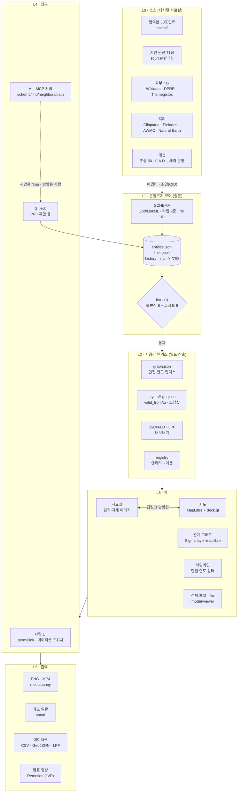

# BLUEPRINT — 온톨로지 지도 시스템 청사진 v0

> 볼트 `Works/비주얼파이프라인/`에서 이관 (2026-09-16). 원본 작성 2026-09-07 · 최종 ?

2026-09-07, 몇 주 쉬고 돌아와 의도부터 다시 세운 문서. 8월의 SPEC("팀원이 레이어 얹어 PNG 뽑는 캔버스")을 대체하는 상위 문서다. 이 문서가 서면 SPEC·CLARIFY·PLAN을 여기에 맞춰 다시 쓴다. 리서치 4건(저장·MCP / 게임 데이터모델 / 3D·내보내기 / 선행 플랫폼·공개데이터)은 2026-09-07 웹 확인분이다.

## 1. 의도 (INTENT)

우리가 만드는 것은 발표용 그림 도구가 아니라 **온톨로지 지도 시스템**이다. 역사 시뮬레이션이자 교육용이고, 결과물을 뽑아내는 에셋 프로그램의 일종이다.

인물뿐 아니라 도시, 기념비적 건물, 제도, 전투, 세력, 국가 영토와 국가 안의 파벌까지 — 공간정보와 함께 표현할 수 있는 모든 것을 객체화해서 온톨로지에 넣는다. 그 객체는 커스텀 모드에서 초상에 맞는 3D 모델이든 2D든 카드든 여러 방식으로 시각화된다. 문명 5, 토탈 워: 로마 2, 코에이 삼국지, EU4 같은 역사 시뮬 게임이 레퍼런스다. 시스템이 정말 잘 짜여 있고, 그 자료와 컨셉을 가져올 수 있다.

사람이 인터랙션하며 볼 수 있을 뿐 아니라, AI가 MCP나 GitHub로 바로 붙어서 화면 뒤의 데이터 레이어를 가져가고, 그걸로 사용자가 원하는 시대·흐름·시각자료·데이터를 정제된 형태로 출력한다. 거대한 데이터베이스이자 시뮬레이션이자 게임인 시스템이다.

로마쇠망사 자료실(사이트)의 데이터와 유기적으로 연결되어, 객체가 무엇과 어떻게 이어져 있는지 알 수 있고, 객체와 상호작용하면 원문 위치와 설명이 같이 뜬다. 기번 원전이 객체화되면 그것도 이 지도에 엮인다.

가장 중요한 것은 **기존 역사 자료를 디지털화한 자료실들을 잘 찾고, 그 데이터를 통합하고, 데이터 흐름과 모든 관계를 잘 정의하는 것**이다. 팔란티어가 기업 문제를 풀 때 반드시 거치는 데이터 정의 → 객체·관계·연결 흐름 정의 → 그 거대한 연결 지도, 그 시퀀스와 같다. 사용자와 관리자에게 당연히 필요한 요소·기능·시각화 방법은 말하지 않아도 전부 고려한다.

### 8월 SPEC과 무엇이 달라졌나

| | 8월 SPEC | 이 청사진 |
|---|---|---|
| 제품 | 팀원이 토큰 얹어 PNG/MP4 뽑는 웹 캔버스 | 온톨로지가 중심인 지도·그래프·타임라인 시스템. 에셋 출력은 그 위의 한 기능 |
| 척추 | 렌더(MapLibre·Three.js 토큰) | **데이터 정의**(스키마·출처·시간·외부 ID) |
| 소비자 | 발표 팀원 5명 | 사람(팀원·River·공개) + **AI 에이전트**(MCP·GitHub) |
| 도메인 | 로마, 나중에 삼국지 | 처음부터 도메인 무관(이미 초한지 데이터셋 실증) |
| 자료실과 관계 | 미래 연동 | 양방향 딥링크가 MVP 조건 |

8/26 중간점검의 진단("엔진을 목적보다 앞서 지었다. 온톨로지→지도 다리가 없다")은 그대로 유효하다. 이 청사진은 그 다리를 제품의 중심으로 놓는다.

### LVP의 뜻

여기서 LVP는 **Lovable Viable Product** — 되는 것(MVP)을 넘어 팀원이 발표 준비 때 먼저 켜고 싶어지고, 외부인이 링크만 받아도 한참 만지작거리는 수준. 기준은 기능 수가 아니라 "헷갈림이 줄고, 뽑은 결과물이 그대로 발표에 나간다"이다.

## 2. 지금 가진 것 (자산 대시보드)

| 자산 | 위치 | 상태 | 청사진에서의 자리 |
|---|---|---|---|
| 온톨로지 정본 | `Books/로마제국쇠망사/ontology/` entities 650 · links 698 · rel 16종 · 좌표 220 | ● 견고 | L1 코어. 그대로 정본 |
| 시계열 GIS 엔진 | 레포 `snas-lifebook/visual-pipeline` (MapLibre·Vite·TS), Pages 배포 | ● 엔진 완성, 데이터 데모 규모 | L3 지도 뷰. 어댑터로 온톨로지를 먹인다 |
| 로마쇠망사 자료실 | `roma-library.pages.dev` + `Works/로마쇠망사_자료실/` SDD 문서 12종 | ● 배포 | 읽기·객체 페이지의 정본 소비자. 지도와 양방향 링크 |
| 관계분석 부품 | `Works/관계분석_방법론/components/` 초상 50 · 세력 문장 8 · 아이콘, 콘솔 2종 | ● 완성 | L3 카드·그래프 뷰의 에셋. `_registry.csv`가 엔티티↔부품 매핑 |
| atlas 프로토타입 | `Books/로마제국쇠망사/atlas/` Leaflet, 출처·신뢰도 모델 | ◐ 검증됨, 렌더 약함 | 데이터 계약의 원형. 코드는 폐기 방향 |
| 레퍼런스 라이브러리 | `Works/비주얼파이프라인/references/` 캡처 74장, `research/` 통합표 | ● | 디자인 참조 |
| P06~08 발표팩 | `Production/2026-09_…/deliverables/` 8탭 HTML | ● 실전 사용 | "발표에서 실제로 쓰인 장면"의 첫 사례 = MVP 장면 후보 |

핵심 비대칭은 여전하다. 온톨로지 연결이 있는 쪽(자료실·Leaflet)은 지도가 약하고, 지도가 강한 쪽(visual-pipeline)은 온톨로지 연결이 0이다.

## 3. 당장 쓸 수 있는 오픈소스·레퍼런스 (2026-09-07 확인)

8월 리서치(MapLibre·Natural Earth·Pleiades·AWMC·OHM·historical-basemaps·Leaflet.timeline 등)는 유효하다. 아래는 그 위에 새로 확인한 것만.

### 3.1 데이터 — 바로 붙일 것

| 이름 | 무엇 | 라이선스 | 우리 쓰임 |
|---|---|---|---|
| **Cliopatria** (Seshat) `github.com/Seshat-Global-History-Databank/cliopatria` | BC3400~2024 전세계 정치체 경계 GeoJSON, 연도별 FromYear/ToYear, Wikidata ID 포함 | **CC BY 4.0** | 로마 영토 시계열 레이어를 자체 트레이싱 없이 즉시 확보. 삼국지·초한지도 같은 파일 |
| **Wikidata** SPARQL | 인물·전투·도시 QID, 외부ID 허브(P1584 Pleiades, P6863 DPRR) | CC0 | 650 엔티티에 QID 컬럼. 생몰·좌표·초상 자동 대조 |
| **DPRR** `romanrepublic.ac.uk` | 로마 공화정 엘리트 프로소포그래피 — 관직(MRR)·사제직·가족, RDF/SPARQL | 데이터 라이선스 사이트에서 확인 필요 | 공화정 인물·관직 이력을 `office.history`로 대량 매핑 |
| **Trismegistos** | 고대 인물·지명 ID 허브, JSON API | CC BY-SA 4.0 | 비엘리트 인물·지명 ID 보강 |
| **PeriodO** `perio.do` | 시대 정의 가제티어, JSON-LD 1파일 | 오픈 | 연도 필드 옆에 표준 시대 ID 한 칸 |
| **Linked Places Format** 1.3 | GeoJSON-LD, `when{}`·`names[]`·`links[]` | 오픈 | 장소 레이어 내보내기 표준. WHG·Peripleo가 바로 읽음 |
| **World Historical Gazetteer** | 역사 지명·이명·좌표, LPF | CC BY 4.0 | 고대 지명 이명(name_history) 보강 |

### 3.2 저장·질의·AI 접근

| 선택지 | 판단 |
|---|---|
| **JSONL 정본 유지 + 빌드타임 `graph.json`·JSON-LD·인덱스** | 650/698 규모엔 이게 정답. DB 없음, 서버 없음 |
| LadybugDB(구 Kuzu, MIT) WASM + `mcp-server-ladybug` | 노드 수천~만, Cypher가 필요해질 때의 2안. Kuzu 본체는 2025-09 아카이브됨 |
| Neo4j AuraDB Free | 30일 미사용 시 삭제 — 스터디 운영에 부적합 |
| **자체 MCP 서버(stdio, TS SDK, ~100줄)** — `get_schema` / `find_entity` / `neighbors(id, year_range)` / `path(a,b)` | 가장 싼 AI 접근. 레포 클론 = 설치. 원격이 필요하면 Cloudflare Workers Streamable HTTP |
| `modelcontextprotocol/servers` **memory** 서버 | 저장 포맷이 JSONL이라 변환만 하면 **코드 0줄로 MCP PoC**. 연도·좌표 필터는 없음 |
| GitHub 공식 원격 MCP | 데이터 편집 워크플로(PR)용으로 병행 |
| 스키마 | **Zod 4**(TS 한 벌을 프론트·MCP·빌드가 공유, JSON Schema 생성) → 표준 어휘 매핑을 진지하게 할 때 **LinkML**(YAML 1개 → JSON Schema·SHACL·OWL·JSON-LD context) |
| 표준 어휘 | CIDOC-CRM 전면 매핑은 과투자. `@context`에 5~6개 힌트만. PeriodO·Pleiades·Wikidata ID 컬럼이 실익 |

### 3.3 뷰·렌더

| 선택지 | 판단 |
|---|---|
| **MapLibre GL** 유지 — 5.24/6.0: 글로브·3D terrain·hillshade·`color-relief` 내장 | 갈아탈 이유 없음. 지형 스킨은 Terrarium DEM 타일이면 됨 |
| **Sigma.js v3 + Graphology + `@sigma/layer-maplibre`** (MIT) | 관계 그래프를 지도 위에 공식 패키지로 오버레이. 경로·중심성은 graphology |
| deck.gl 9.4 `@deck.gl/maplibre` (MIT) | TripsLayer 행군·PolygonLayer 전환. Three.js 토큰과 역할 분담(데이터 레이어 vs 모델) |
| `fill-pattern` 해칭 · `heatmap` 영향권 · `fill-extrusion` 수량 | 세력 내부 파벌·클리엔텔라·병력 규모 표현. 스프라이트 몇 장으로 끝 |
| flubber (MIT) | 영토 폴리곤 morph. 동결됐지만 의존성 0 |
| `<model-viewer>` (Apache-2.0) | 인물·건물 glTF를 태그 하나로. 상세 카드 모달 |
| CesiumJS | CZML은 우리 타임라인과 정확히 같은 개념이지만 **Timeline 위젯이 BCE에서 깨진다.** LVP "지구본 쇼케이스" 옵션으로만 |
| Kepler.gl(MIT) · Peripleo(MIT) · TimelineJS3(MPL) | 코드 없이 데모·교육 카드 출력. 본 시스템 부품은 아님 |

### 3.4 에셋·내보내기

| 선택지 | 판단 |
|---|---|
| **0 A.D.** 아트 (`gitea.wildfiregames.com/0ad/0ad`, `binaries/data/mods/public/art/`) | 로마·카르타고·갈리아·그리스 건물·유닛 DAE, 문명 엠블럼. **CC-BY-SA 3.0** — Blender로 glTF 변환 후 웹 재사용 가능(출처+SA) |
| Sketchfab CC 모델 | 무료 다운로드 종료 예고 상태. **필요한 로마 모델은 지금 받아둘 것** |
| **TRELLIS.2** (MIT, 24GB GPU/클라우드) | 초상 50장 → 흉상 GLB. **Hunyuan3D는 라이선스가 대한민국 제외 — 어느 단계에도 쓰지 않는다** |
| Meshy (무료 100크레딧/월, Pro $20) | GPU 없을 때 대안 |
| MapLibre `preserveDrawingBuffer` + 오프스크린 합성 | 고해상 PNG |
| **mediabunny** (MPL) / canvas-record | 브라우저에서 캔버스 → MP4. 서버 없음 |
| satori + resvg-wasm / modern-screenshot | 인물 카드 50장 일괄 생성 (한글 폰트 TTF 동봉) |
| Remotion (개인 무료) | LVP 오프라인 발표 영상 |

### 3.5 구조를 베낄 게임·플랫폼

| 출처 | 베낄 패턴 |
|---|---|
| EU4/CK3 history 파일 | **base + history[] 분리** — 불변 속성 + `[{date, patch}]`, 연도 지도는 patch를 그 날짜까지 접어 재구성 |
| CK3 title history | **자리(office)가 1급 객체**, 인물은 holder. `office.history=[{date, holder}]`에서 `holds_office` 파생 |
| EU4 owner/controller/core | `place`↔`faction`을 **controls / claims / core** 3분 — 속주·동맹시·점령지 구분 |
| EU4 estates · Rome 2 정파 | `faction`에 type(계급·정파·가문·군벌)·leader·members·시대별 influence/loyalty·demand → 개혁·내전 사건과 `triggers` |
| Civ5/Unciv 룰셋 | 문자열 Type 키 + 타입별 파일 + 정션 테이블. `Eras` = 타임라인 구간 |
| nodegoat | "타입·관계를 정의하면 지도·네트워크·타임라인이 따라오는" 워크플로 |
| CIDOC-CRM(ResearchSpace/Arches) | 이벤트 중심 — 인물·장소·세력을 사건으로 잇고 시간·출처는 사건에 |
| Chronas · Kindred Britain | 단일 연도 슬라이더 상태 + 두 객체 간 최단 경로 강조 + permalink 공유 |
| Foundry 온톨로지 | 오픈소스 대응물은 **없다**(스텁 1개). LinkML 스키마 + 파일/DB + MCP 액션으로 직접 구성 |

## 4. 아키텍처 (BLUEPRINT)

원칙 다섯. 정본은 L1 하나이고 나머지는 전부 빌드 산출물이다. 시간은 모든 객체의 1급 속성이다(`history[]`, `valid_from/to`, 기원전 음수). 출처와 신뢰도는 레코드마다 붙고 `src`로 계통(편역본/원전/외부)을 가른다. 라이선스는 퍼블릭 도메인·CC BY·자체 저작만 재배포하고 카피레프트는 참조·트레이싱만(단 Cliopatria·0 A.D.는 조건 지키고 직접 포함). AI는 읽기는 자유, 쓰기는 제안만.

## 5. 데이터 모델 (SCHEMA 개정 방향)

지금 rel 16종·타입 7종 위에 아래를 얹는다. 기존 데이터는 깨지지 않는다 — 전부 선택 필드거나 새 타입이다.

| 추가 | 무엇 | 왜 |
|---|---|---|
| `history[]` | 모든 엔티티에 `[{year, patch}]` — 통치자·수도·인구·영토 상태 변화 | 연도 지도 = patch 접기. EU4 패턴 |
| 타입 `faction` | 세력 안의 세력: type(계급·정파·가문·군벌), leader, members, 시대별 influence·loyalty | "국가 내 세력" 요구. 원로원파·민중파·율리우스 가문 |
| 타입 `office` | 자리 객체: 콘술·호민관·속주총독·황제, max_holders·term, `history=[{year, holder}]` | 관직 7종이 온톨로지에 없다는 QC 미결 해소. DPRR이 그대로 들어옴 |
| `institution` 확장 | requires[]·established_by, government_form history(왕정→공화정→원수정) | 제도 트리 시각화 |
| place↔faction rel 3분 | `controls` / `claims` / `core` | 시칠리아 영토 BC241 vs 속주 BC227 같은 구분 |
| `src` | 서술·링크마다 `point` / `gibbon` / `wikidata` / `dprr` | 8/26 권고. 원전 통합을 재작성이 아니라 필터로 |
| 외부 ID | `wikidata`, `pleiades`, `dprr`, `periodo`, `trismegistos` | 조인 키. 좌표·생몰 자동 검증 |
| `assets[]` | registry 참조: 초상·문장·GLB | 뷰가 에셋을 찾는 유일한 경로 |
| 내보내기 | LPF(장소) · JSON-LD `@context`(CIDOC 힌트 5~6개) | 외부 도구·AI가 표준으로 읽게 |

## 6. 기능 인벤토리 (사용자·관리자)

### 사용자

탐색은 연도 슬라이더 하나가 지도·그래프·타임라인·패널을 동시에 갱신하는 **단일 시간 상태**로 묶인다. 레이어(영토·속주·파벌·도시·도로·항로·자원·지형지물·전투·이동)는 켜고 끄고, 줌에 따라 LOD가 자동으로 바뀌며, 스킨(고지도·위성·지형·토탈워풍)을 갈아입는다. 객체를 클릭하면 패널에 설명·연도·관계·등장 포인트·출처 배지·초상(또는 3D)이 뜨고, 자료실의 본문 위치로 건너갈 수 있으며 반대로 자료실 객체 페이지에서 "지도에서 보기"로 돌아온다. 두 객체를 고르면 최단 관계 경로가 강조되고, 검색은 이름·이명·초성으로 된다. 지금 화면은 permalink(연도·레이어·중심·선택 객체가 URL에)로 공유되고, 데이터셋 스위처로 로마↔초한지↔삼국지를 오간다. 내보내기는 현재 화면 PNG, 슬라이더 구간 MP4, 선택 객체 카드 이미지, 현재 연도 GeoJSON/CSV.

### 관리자 (서버 없이 GitHub이 백오피스)

스키마는 코드(Zod/LinkML)이고 변경은 PR이다. 린트 CI가 불변식·그래프 검사·라이선스 대장 누락을 잡는다. AI와 팀원의 데이터 제안은 `/tmp`·이슈·PR로 들어와 사람이 병합한다. 출처·신뢰도·`src`가 빠진 레코드는 빌드가 막는다. 외부 KG(Wikidata·DPRR) 동기화 스크립트는 diff만 내고 자동 반영하지 않는다. QC 대시보드(고아 노드·연도 미상·동명이인 후보·좌표 없는 장소)는 빌드 산출물 페이지 하나로. 에셋 레지스트리와 크레딧 페이지는 자동 생성. MCP 서버는 읽기 전용이 기본이고, 쓰기 툴은 "제안 파일 생성"만 한다.

## 7. 로드맵 — 다리 → MVP → LVP

### Phase 0 · 다리 (지금부터 2주)

온톨로지→dataset 어댑터 스크립트(entities/links → `graph.json` + `layers/*.geojson`)를 만들어 visual-pipeline이 650개 엔티티를 먹게 한다. `src`·외부 ID 컬럼을 상수로 넣고 Wikidata QID를 인물·전투·도시에 우선 매핑한다. Cliopatria에서 로마 구간을 잘라 territory 레이어로 교체한다. 린트를 CI로 올린다. `server-memory` 변환으로 MCP PoC를 30분 안에 띄워본다. 그리고 **첫 장면을 하나 정한다** — 후보는 이미 발표에 쓰인 P06~08 "카이사르 관계선 적대 비율 10→30→44%"를 지도+그래프+타임라인에서 재생하는 것.

### MVP (이후 4~6주) — "되는 것"

지도·그래프·타임라인이 한 화면에서 같은 연도를 본다(Sigma `layer-maplibre`). 지명 라벨과 최소 지리(해안·강·주요 도시)가 있어 방향을 잡을 수 있다. 객체 패널과 자료실 딥링크가 양방향으로 된다. `office`·`faction` 타입이 스키마에 들어가고 DPRR로 공화정 관직 이력을 채운다. permalink·데이터셋 스위처. 내보내기는 PNG·MP4·카드 50장. 자체 MCP 서버 4툴을 레포에 동봉한다. 이 상태로 한 회차 발표에 실제로 쓴다.

### LVP — "사랑받는 것"

파벌·제도·관직의 시대별 history가 채워져 "이 해에 누가 무엇을 쥐고 있었나"를 클릭 한 번으로 본다. 초상 50장이 TRELLIS.2로 흉상 GLB가 되고 0 A.D. 건물이 도시 위에 선다(`<model-viewer>`·GLTFLoader). deck.gl TripsLayer 행군, flubber 영토 morph, 지형 스킨(hillshade·color-relief). Remotion으로 발표 영상을 오프라인 렌더. 기번 원전 축(`src=gibbon`)이 열려 편역본/원전 토글이 된다. 삼국지 데이터셋이 정식으로 들어와 도메인 무관이 실증된다. 관리자 QC 대시보드와 외부 KG diff 파이프라인. 원격 MCP(Cloudflare Workers). 그리고 "시뮬레이션"은 what-if 연산이 아니라 **온톨로지 재생**(replay)으로 정의한다 — 데이터가 시간을 따라 스스로 움직이는 것.

### 지금은 안 하는 것

실시간 전투·경제 연산, 서버 DB, Cesium 전면 채택, Hunyuan3D, CIDOC-CRM 전면 매핑, 기번 원전 71장 선제 온톨로지화.

## 8. 결정이 필요한 것 (CLARIFY로 승격)

| # | 결정 | 선택지 | 트레이드오프 한 줄 |
|:--:|---|---|---|
| D1 | 이름·레포 | (a) `visual-pipeline` 유지 (b) 크로노아틀라스로 개명·레포 신설 (c) 자료실 레포에 `/map`으로 통합 | a는 이력 유지, b는 정체성 명확, c는 딥링크가 공짜지만 레포가 무거워짐 |
| D2 | 첫 장면 | (a) P06~08 카이사르 관계 재생 (b) 한니발 원정 (c) 제1차 포에니 시칠리아 영토·속주 | a는 발표 실적이 있고 그래프+지도+시간 셋 다 쓴다 |
| D3 | 저장 계층 | (a) JSONL + 빌드 인덱스 (b) LadybugDB WASM | a는 지금 규모의 정답, b는 Cypher가 필요해질 때 |
| D4 | 그래프 뷰 | (a) Sigma+layer-maplibre (b) Cytoscape.js 별도 패널 | a는 지도 위 오버레이가 공식 지원, b는 분석 API가 풍부 — **2026-09-08 결정: (c) 하이브리드.** 별도 패널(옵시디언 로컬 그래프식 force 캔버스, 의존성 0, `src/app/GraphPanel.tsx`) + 지도엔 좌표 있는 선택·이웃 ≤12일 때만 선, 그 외 관련 지점 강조. 지도 위 링 배치는 '사방팔방'이라 기각(River) |
| D5 | 영토 데이터 | (a) Cliopatria를 정본으로 (b) 참조만 하고 자체 트레이싱 유지 | a는 즉시·전 시대·CC BY, b는 정밀도·BC218 국면 통제 |
| D6 | 스키마 도구 | (a) Zod 4 (b) LinkML | a는 TS 한 벌, b는 표준 어휘·JSON-LD 생성이 공짜지만 Python |
| D7 | 자료실 관계 | (a) 별도 앱 + 딥링크 (b) 한 레포 (c) 자료실 안에 iframe | D1과 묶어 정함 |
| D8 | 3D 범위 | (a) MVP는 `<model-viewer>` 카드까지 (b) 지도 위 GLB 토큰까지 | a가 연출<콘텐츠 원칙에 맞음 |

D2가 먼저다. 8/26에도 같은 결론이었다 — 첫 장면이 정해지면 D3~D8은 대부분 따라온다.

## 관련

- 8월 문서: [SPEC](SPEC.md) · [SCHEMA](SCHEMA.md) · [CLARIFY](CLARIFY.md) · [비주얼시스템_중간점검_20260826](비주얼시스템_중간점검_20260826.md)
- 이웃 프로젝트: `볼트 자료실 MOC` · `볼트 관계분석 방법론` · `볼트 온톨로지 MOC`
- 리서치 원문(이 세션): 저장·MCP / 게임 데이터모델 / 3D·내보내기 / 선행 플랫폼·공개데이터 — `research/20260907_*.md`로 저장 예정
