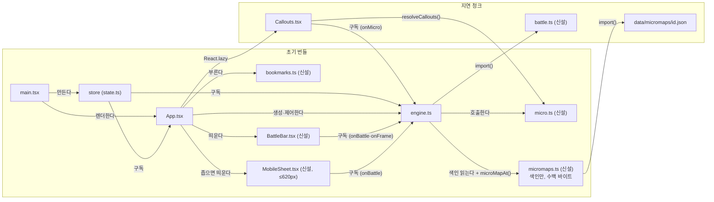
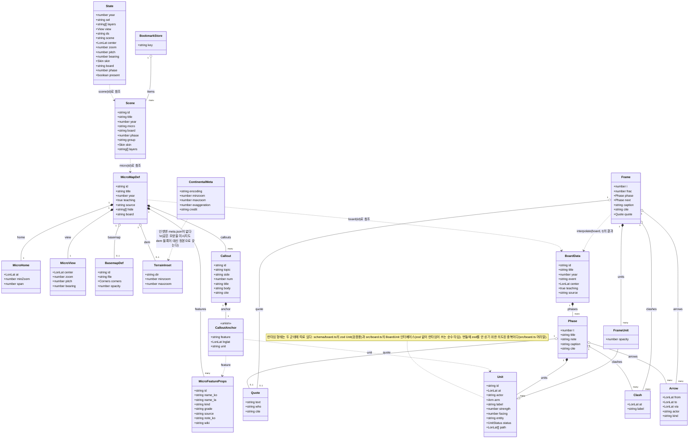
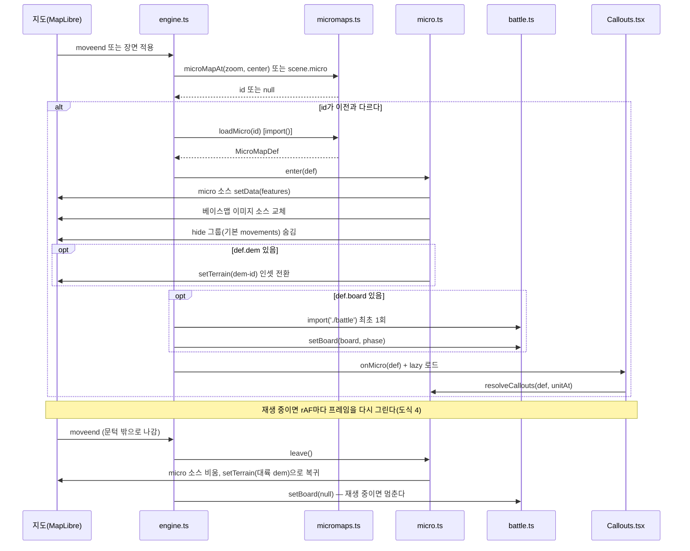
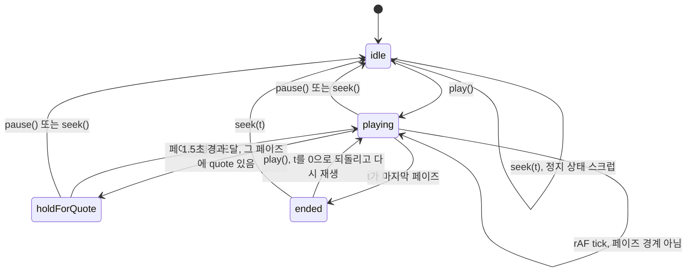
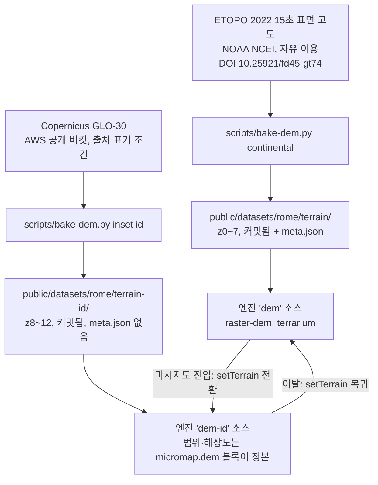
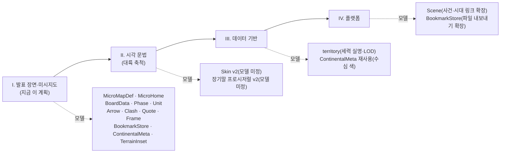

# MODELS: 모델링 시각화 (AI와 사람이 같이 보는 설계도)

**이 문서를 고칠 때.** 모델(스키마·State·Scene·엔진 반환 API)이 바뀌는 커밋은 이 문서의 해당 도식을 같은 커밋에서 고친다. 데이터 모델 도식은 나중에 `scripts/models-diagram.mjs`가 zod에서 생성하도록 바꿀 예정이며, 그때까지는 손으로 맞춘다.

이 문서는 지금 코드(2026-09-16 상태)와 `docs/OVERHAUL.md` 전면 개선(2026-09-17 착수, 슬라이스 I)이 계획한 모델을 함께 그린다. 계획 단계인 것(미시지도 레지스트리·말판 v2·전투 재생·북마크·DEM 두 층)은 아직 코드에 없다 — 세부 규칙은 여기 적지 않고 `OVERHAUL.md`와 계획 문서로 링크만 한다(CONSTITUTION 0-4).

## 1. 모듈 지도

무엇을 보여주나: 부팅 흐름과 모듈 사이 호출 관계, 그리고 초기 번들에 실리는 것과 나중에 `import()`되는 것의 경계.

정본: [OVERHAUL.md §3.1](OVERHAUL.md) 아키텍처 그림, [계획 1/4](plans/2026-09-17-overhaul-I-1-foundation.md) Task 1.3·1.4, [계획 3/4](plans/2026-09-17-overhaul-I-3-battle.md) Task 4.3.

## 2. 데이터 모델

무엇을 보여주나: 상태·장면·미시지도·말판·프레임·북마크가 서로를 참조하는 방식. 필드 이름은 스키마·계획 문서에 적힌 것 그대로다.

정본: [schema/micromap.ts](../schema/micromap.ts)·[schema/board.ts](../schema/board.ts)(계획 1/4·3/4에서 신설·확장), [src/board.ts](../src/board.ts) `interpolate`/`Frame`(계획 3/4 Task 4.2), [src/bookmarks.ts](../src/bookmarks.ts)(계획 4/4 Task 6.1), [OVERHAUL.md §3.2](OVERHAUL.md) 데이터 계약.

## 3. 데이터 흐름: 미시지도 진입·이탈

무엇을 보여주나: 지도가 미시 축척에 들어가고 나올 때 어떤 모듈이 어떤 순서로 불리는가. 전투 재생이 있으면 그 위에 얹힌다.

정본: [OVERHAUL.md §3.3](OVERHAUL.md) 데이터 흐름 1~5행, [계획 1/4](plans/2026-09-17-overhaul-I-1-foundation.md) Task 1.4 Step 3(`syncDetailMaps`), [계획 3/4](plans/2026-09-17-overhaul-I-3-battle.md) Task 4.3 Step 2.

## 4. 전투 재생 상태

무엇을 보여주나: 재생 버튼을 눌렀을 때 `battle.ts`의 rAF 루프가 도는 상태와 전환 조건.

페이즈 전환은 1.5초 고정, 재생 속도 조절 UI는 없다. 단축키는 `P`(재생·정지), `.`·`,`(한 페이즈 앞뒤)다.

정본: [OVERHAUL.md §3.6](OVERHAUL.md) 「재생 규칙」, [계획 3/4](plans/2026-09-17-overhaul-I-3-battle.md) Task 4.3 `step()` 함수.

## 5. DEM 두 층

무엇을 보여주나: 대륙 지형과 미시지도 인셋 지형이 서로 다른 소스·굽는 스크립트·해상도를 갖고, 미시 진입 시 소스가 바뀌는 구조.

인셋은 별도 `meta.json`을 두지 않는다 — 범위(`home.at`±`home.span`)와 줌 범위는 각 미시지도 파일의 `dem` 블록이 유일한 정본이다(같은 숫자를 두 곳에 적지 않는다, CONSTITUTION 0-4). AWS Terrain Tiles(옛 파이프라인, `AGENTS.md` 「기하 3D 지형」 절)는 라이선스가 섞여 있어 이 계획에서 걷어낸다.

정본: [OVERHAUL.md §3.7](OVERHAUL.md), [계획 2/4](plans/2026-09-17-overhaul-I-2-dem-micromaps.md) Task 2.1~2.3, [scripts/bake-dem.py](../scripts/bake-dem.py)(계획에서 신설).

## 6. 레이어 그룹과 스킨

무엇을 보여주나: 엔진 `LAYER_GROUPS`(지금 코드, `src/map/engine.ts:206`)에 실재하는 그룹과 그 데이터 출처. `alesia`·`roma`·`alexandria`·`board`는 이번 개선으로 바뀐다.

| 그룹 | 층(요약) | 출처 | 비고 |
|---|---|---|---|
| `plains` | plains-granary·barren·line·label | 교보재(`data/overlays/pack-plains.json`) | 세력이 아니라 지리. 장면이 켤 때만 |
| `territory` | territory-fill·outline·label 등 | 정본 어댑터 산출물(`layers/territory.geojson`) | |
| `admin_regions` | admin-line | 정본 어댑터 산출물 + 교보재 색 오버라이드(`pack-polity-colors.json`) | 기하는 정본, 색만 덮는다 |
| `settlements` | settle-major·minor·라벨 | 정본 어댑터 산출물(`layers/settlements.geojson`) | |
| `battles` | battle | 정본 어댑터 산출물(`layers/battles.geojson`) | 정본 전투 전부(69개) |
| `story_battles` | pack-battle·label | 교보재(`data/overlays/pack-battles.json`) | 이 발표가 말하는 전투만 |
| `movements` | movement·halo·arrow·seq | 정본 산출물(`layers/movements.geojson`) + 교보재(`pack-pompey.json`) 합성 | 미시지도 기본 `hide` 대상 |
| `relief` | relief·hillshade | 정본 파이프라인 래스터 / DEM(도식 5) | DEM이 있으면 hillshade가 relief.jpg를 대체 |
| `bathy` | bathy | 정본 파이프라인 래스터(`fetch-external`) | |
| `rivers` | rivers-major·minor | 정본 어댑터 산출물 | |
| `labels` | label-settle-1~3·region-name | 정본 어댑터 산출물(settlements 재사용) | |
| `landmarks` | landmark-region_labels·pleiades 등 | 정본 어댑터 산출물(`layers/landmarks.geojson`, Pleiades) | |
| `graph` | ego-edge | 정본 그래프 산출물(`graph.json`) | 노드·이름표는 다른 층이 그린다 |
| `board` | board-unit·label (지금) | 말판(`data/boards/*.json`) | 계획: `battle.ts`의 `BATTLE_LAYERS` 7종으로 교체 |
| `people` | people-dot·pad·label·standard·force | 교보재(`data/overlays/pack-peoples.json`) | |
| `alesia`/`roma`/`alexandria` | 각 지도 하드코딩 31개 층 | 교보재 하드코딩(`pack-alesia.json` 등) | 계획: 사라지고 `micro`(레지스트리, `data/micromaps/*.json`)로 대체 |

계획이 끝나면 `alesia`·`roma`·`alexandria` 세 그룹은 없어지고 `micro`(범용 렌더러, `micro-basemap`~`micro-label`) 하나가 그 자리를 대신한다.

정본: [src/map/engine.ts](../src/map/engine.ts) `LAYER_GROUPS`(206행), [src/packData.ts](../src/packData.ts), [OVERHAUL.md §3.1](OVERHAUL.md) 「지금과 달라지는 것」.

## 7. 슬라이스 지도

무엇을 보여주나: 전면 개선 네 슬라이스가 어느 순서로 나오고 각각 어떤 모델(도식 2의 클래스)을 만지는가.

II·III·IV는 각자 스펙을 따로 쓴다(OVERHAUL §4). II의 스킨·장기말 모델은 아직 이 문서에 없다 — 그 스펙이 나오면 도식 2에 클래스를 더한다.

정본: [OVERHAUL.md §2](OVERHAUL.md) 분해 표, [OVERHAUL.md §4](OVERHAUL.md) 슬라이스 II~IV 범위.
