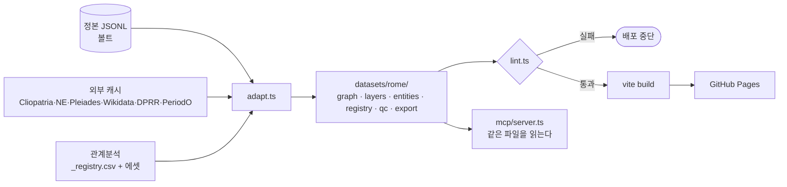
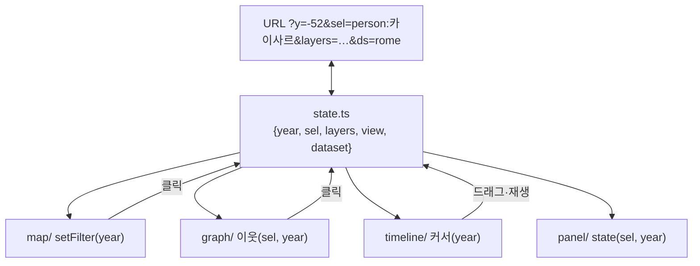

# PLAN — 어떻게 만드나

> 볼트 `Works/비주얼파이프라인/`에서 이관 (2026-09-16). 원본 작성 2026-08-14 · 최종 2026-09-07

무엇은 [SPEC](SPEC.md), 데이터는 [SCHEMA](SCHEMA.md), 화면은 [DESIGN](DESIGN.md). 이 문서는 스택·레포 구조·파이프라인·검증 방식만 정한다. 원칙은 하나 — **이미 있는 것을 잇는다.** 엔진(visual-pipeline)·데이터(온톨로지)·에셋(관계분석)·사이트(자료실)가 다 있으므로 새로 짓는 것은 어댑터·그래프 뷰·패널·내보내기·MCP 다섯뿐이다.

## 스택

| 층 | 선택 | 상태 | 이유 |
|---|---|---|---|
| 빌드·번들 | Vite · TypeScript · Vitest | 있음 | 유지 |
| 스키마·린트 | Zod 4 → JSON Schema 생성. 린트는 `scripts/lint.ts` 하나 | 신규 | 프론트·MCP·빌드가 한 벌 공유 |
| 지도 | MapLibre GL 6.x(글로브·terrain·hillshade-method·color-relief) | 있음 | 유지. DEM은 Mapterhorn PMTiles(지중해 extract, 정적 호스팅) + GEBCO 수심 terrarium |
| UI 크롬 | **astryx**(자료실과 같은 패키지·neutral 테마) + React 19 | 신규 | 자료실과 한 시스템(DESIGN P1). 지도·그래프는 React 밖 캔버스, 크롬만 React |
| 래스터 | PMTiles(`pmtiles` npm) | 신규 | 서버 없이 range request로 타일 |
| 그래프 | Sigma.js v3 + Graphology + `@sigma/layer-maplibre` | 신규 | 지도 위 오버레이 공식 지원. 경로·중심성은 graphology |
| 지도 데이터 레이어(P1) | deck.gl 9.4 `@deck.gl/maplibre` TripsLayer/PolygonLayer | 신규(P1) | 행군·morph. MVP는 MapLibre 네이티브 레이어로 충분 |
| 토큰·3D | Three.js 오버레이(있음) + GLTFLoader · `<model-viewer>` · TRELLIS.2(로컬/클라우드 GPU 배치) | 있음/신규 | D8: MVP에 지도 위 GLB 토큰 3인. 흉상 생성은 빌드 밖 배치 스크립트, 결과 GLB만 `assets/`에 |
| 타임라인 | 자체(기존 `timeline.ts` 확장) | 있음 | 라이브러리 불필요. BCE 때문에 Cesium 등 외부 타임라인은 배제 |
| 검색 | `es-hangul` 인메모리 필터 | 신규 | 자료실과 동일 방침(초성 검색 공짜) |
| 내보내기 | `preserveDrawingBuffer` + 오프스크린 합성 PNG · mediabunny MP4 · modern-screenshot 카드 | 신규 | 전부 브라우저, 서버 0 |
| MCP | `@modelcontextprotocol/sdk` stdio, 툴 4개 | 신규 | 레포 `mcp/` 폴더, `npx tsx mcp/server.ts` |
| 배포 | GitHub Pages(Actions) | 있음 | 유지. 커스텀 도메인은 팀 배포 시 |
| 외부 데이터 | Cliopatria · Natural Earth · Pleiades(물리 유형 포함) · AWMC · Wikidata · DPRR · PeriodO · **Mapterhorn · GEBCO_2026 · ERA5 · CMEMS · CHELSA-TraCE21k · Euro-Med2k** | 빌드타임 fetch → `datasets/`에 굽기 | 런타임 외부 호출 0(CONSTITUTION 6-2). 큰 래스터는 PMTiles로 레포 밖 정적 버킷/릴리즈 에셋에 |

의존성 추가는 `sigma` `graphology` `@sigma/layer-maplibre` `zod` `es-hangul` `mediabunny` `modern-screenshot` `@modelcontextprotocol/sdk` `@google/model-viewer` `pmtiles` `react` `react-dom` `@astryxdesign/core`(+neutral 테마) 13개. deck.gl은 P1에서. TRELLIS.2는 레포 의존성이 아니라 `tools/bust/` 배치 스크립트(Python)로 분리.

## 레포 구조 (`~/Projects/chronoatlas`, D1)

새 레포 `snas-lifebook/chronoatlas`. visual-pipeline의 `src/`·`datasets/`·`tests/`·Actions를 첫 커밋으로 옮기고 옛 레포는 아카이브 + README 리다이렉트. Pages 주소는 `snas-lifebook.github.io/chronoatlas/`.

```
chronoatlas/
├── CONSTITUTION.md          볼트 CONSTITUTION의 실행 미러
├── AGENTS.md                AI가 먼저 읽는 것 — 빌드·린트·MCP·하지 말 것
├── schema/                  Zod 스키마 (entity · link · feature · manifest) → json-schema/ 생성
├── scripts/
│   ├── adapt.ts             정본 JSONL → datasets/rome/ (F1)
│   ├── lint.ts              불변식·그래프·완결·라이선스 (F11)
│   ├── fetch-external.ts    Cliopatria·NE·Pleiades·Wikidata·DPRR·PeriodO → data/external/ (캐시, 커밋)
│   ├── registry.ts          관계분석 _registry.csv + 에셋 → registry.json
│   └── qc.ts                qc.json
├── datasets/
│   ├── rome/ · chuhan-206/  빌드 산출물 (커밋함 — 배포가 정적이므로)
├── data/external/           외부 원본 캐시 + LICENSES.md
├── src/
│   ├── state.ts             단일 연도 상태 + URL 동기화 (F2·F8)
│   ├── map/                 MapLibre 레이어·스킨·LOD (F3·F17)
│   ├── graph/               Sigma 오버레이·이웃·경로 (F4·F14)
│   ├── timeline/            틱·시대 띠·재생 (F5)
│   ├── panel/               객체 패널·자료실 링크 (F6)
│   ├── search/              es-hangul (F7)
│   ├── export/              png · mp4 · card · geojson (F9)
│   └── main.ts              배선만
├── mcp/server.ts            F10
├── assets/                  초상·문장·GLB (관계분석에서 복사, 출처 대장 동반)
├── tools/bust/              TRELLIS.2 배치 — 초상 PNG → GLB (Python, 레포 의존성 아님)
├── tests/                   vitest — 어댑터·린트·상태·시간 fold·내보내기 합성
└── .github/workflows/       lint → build → pages
```

정본 온톨로지는 여기 없다. `adapt.ts`가 볼트 경로(`ONTOLOGY_DIR` env)에서 읽는다. 미러 레포(`decline-and-fall-of-the-roman-empire`)를 서브모듈로 두는 안은 접었다 — 볼트가 정본이고 미러는 수동 사본이라 이중화가 된다.

## 데이터 파이프라인



세 입력, 한 출력. MCP와 브라우저가 **같은 `datasets/`**를 읽는다(CONSTITUTION 10-1).

## 화면 조립 (한 상태, 네 뷰)



뷰는 상태를 구독만 한다. 뷰끼리 직접 부르지 않는다 — 이게 "같은 해"를 보장하는 유일한 방법이다.

## MCP 서버

| 툴 | 입력 | 출력 |
|---|---|---|
| `get_schema` | — | 타입·rel·필드 정의(JSON Schema) + 데이터셋 목록 |
| `find_entity` | `q`, `type?` | 이름·이명·초성 매치 상위 20 (id·type·연도·등장 포인트) |
| `neighbors` | `id`, `from_year?`, `to_year?`, `rels?` | 1홉 이웃 + 링크(연도·출처) + 그 해 `state` |
| `path` | `a`, `b`, `max_hops=4` | 최단 관계 경로(graphology) |

읽기 전용. 쓰기 계열은 P2에서 `propose_change`(파일 생성)만. 원격은 P2 Cloudflare Workers(Streamable HTTP).

## 자료실 연동 (D7)

- 자료실 객체 페이지 → `https://snas-lifebook.github.io/chronoatlas/?ds=rome&sel={id}&y={첫 등장 연도}`
- 지도 패널 → `https://roma-library.pages.dev/objects/{type}/{slug}` · 포인트 본문 `/read/point/{n}#{slug}`
- 주소는 양쪽 다 `links.ts` 레지스트리 한 곳에. 자료실은 이미 그 패턴(`site/lib/links.ts`)이다.

## 검증 방식 (TDD)

RED부터. 어댑터·린트·상태·시간 fold·내보내기 합성 다섯이 테스트 대상이고, 렌더는 Playwright 스크린샷 비교(자료실과 같은 방식). 뷰 코드에는 로직을 두지 않으므로 뷰 단위테스트는 없다.

| 대상 | 첫 RED 테스트 |
|---|---|
| adapt | 정본 객체 수 == graph.json 노드 수, `[lon,lat]` 범위 |
| lint | `held_office`가 links에 있으면 실패 · 기원전 양수 실패 · 고아 리포트 |
| state | URL→state→URL 왕복 동일 |
| time fold | `history` 3건에서 `state(-50)`이 -59 patch만 반영 |
| export | 두 캔버스 합성 PNG 크기 = 2×viewport |

## 안 하는 것

서버·DB · 로그인 · 편집 UI · 자체 타임라인 라이브러리 도입 · Cesium · Hunyuan3D · 미러 레포 서브모듈.

## 관련

[TASKS](TASKS.md) 순서 · [DESIGN](DESIGN.md) 화면 · [TOOLING](TOOLING.md) 스킬·도구 · `research/20260907_*.md` 근거
