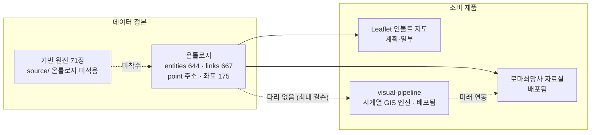

# 비주얼 시스템 중간점검 (2026-08-26)

> 볼트 `Works/비주얼파이프라인/`에서 이관 (2026-09-16). 원본 작성 2026-08-26 · 최종 ?

병렬 조사 4건(코드 감사, 온톨로지 진화, 프롬프트 산재, 리서치 인벤토리)을 엮은 중간점검이다. 한 줄 결론부터 적는다.

> **준비가 안 된 게 아니다. 엔진을 목적보다 앞서 지었을 뿐이다.** 다음 한 걸음은 새 기능이 아니라, 이미 가진 두 자산(온톨로지 데이터 + 지도 엔진)을 잇는 다리와, "누구의 어떤 장면인가"를 정하는 것이다.

상태 표기: ● 작동·완성 · ◐ 부분·드리프트 · ○ 없음·미착수

## 한눈 대시보드

| 구성요소 | 상태 | 한 줄 진단 |
|---|:---:|---|
| visual-pipeline 엔진 | ● | 배포됨. 시간필터·타임라인·전투·경로·토큰·상세패널, 테스트 12/12. 필요 이상으로 앞서 있다 |
| visual-pipeline 데이터 | ○ | territory 18·전투 6, 손타이핑 데모 규모. 확장 저작 수단 없음 |
| 온톨로지 데이터 | ● | entities 644·links 667, 견고. 엔티티 id가 point-독립이라 진화에 강함 |
| 온톨로지 → 지도 다리 | ○ | **없음.** 책→지도가 프로젝트 존재 이유인데 배선 0. 최대 결손 |
| 로마쇠망사 자료실(사이트) | ● | 배포됨. 온톨로지를 실제로 소비하는 유일한 완성 소비자 |
| Leaflet 인볼트 지도 | ◐ | 온톨로지 연결은 되나(점 175·관계 603) 렌더 약함. 시간 슬라이더·폴리곤 없음 |
| 기번 원전(71장) 온톨로지화 | ○ | `source/`에 원문만 있고 엔티티 링크 0. 미착수 |
| 프롬프트·원문 기록 | ◐ | 같은 이름 파일 6곳, 형식 제각각. 원문은 세션 로그에 이미 있는데 손 전사 중 |
| 리서치·툴 결정 | ● | MapLibre·Natural Earth·라이선스 전략까지 사실상 확정. 부족하지 않다 |

핵심 비대칭: **온톨로지 연결을 가진 쪽(Leaflet)은 렌더가 약하고, 렌더가 강한 쪽(visual-pipeline)은 온톨로지 연결이 없다.** 둘이 만나야 한다.

## 시스템 지도

실선은 지금 흐르는 것, 점선은 끊긴 것과 미래다. 이 그림에서 점선 세 개가 곧 할 일의 지도다.

## 1. 비주얼 시스템 진단: 왜 "준비 안 됨"을 느끼는가

부족해서가 아니라, 세 곳이 **끊겨** 있어서다.

### 목적 단절 (가장 큼)

엔진은 배포된 완성형인데, 정작 프로젝트 존재 이유인 "책을 지도로"가 배선되어 있지 않다.

- **온톨로지 다리 없음**: visual-pipeline의 rome 데이터셋은 손으로 친 JSON이다. 644개 엔티티·667개 관계와 아무 연결이 없다. 지도가 소비할 콘텐츠가 구조화되어 이미 있는데, 엔진은 그걸 안 먹는다.
- **데이터가 데모 규모**: territory 18·전투 6·이동 2경로. 엔진은 삼국지·초한지까지 재사용을 실증했는데, 정작 로마 콘텐츠가 시드 분량이다.
- **지리 가독성 부재**: 베이스맵·지명 라벨·강·지형이 없다. 사용자는 파란 배경 위 색 덩어리를 본다. 방향을 못 잡는다.
- **소비자·장면 미결**: River 이해용인가, 편데 발표용인가, 공개 도구인가? 셋 다 조금씩 서빙하고 아무도 끝까지 서빙하지 않는다.

### 스코프 과대 (오버엔지니어링 신호)

로드맵은 3D 지형과 한니발 알프스 시뮬(토탈워)을 꿈꾸는데 토대는 18개 폴리곤이다. Three.js 토큰 행군·pitch 같은 렌더 장식에 노력이 가 있고, 쓸모를 만드는 데이터는 얇다. **연출이 콘텐츠를 앞질렀다.**

### 문서 드리프트 (방향감각 상실의 원인)

정본이 실제와 어긋나 있어, "지금 이게 뭔지"를 말해주는 단일 문서가 없다. 이게 혼란의 정체다.

| 문서 | 적힌 값 | 실제 |
|---|---|---|
| SDD `SPEC.md`·`TASKS.md` | "갱신 필요" 표시된 채 | 코드가 앞서감 |
| 온톨로지 설계문서 | 객체 619·관계 603 | 644·667 |
| visual-pipeline README | settlements 5·movements 11 | 10·17 |
| 관계 어휘 문서 | 최종 11종 | 데이터 15종 |
| 메모리·MOC의 방법론 경로 | `AIOS/studies/…` (빈 폴더) | `AIOS/design/책에서-온톨로지-만드는-법.md` |

### 처방 (레버리지 순)

| 순 | 할 일 | 왜 | 비용 |
|:--:|---|---|---|
| 1 | **온톨로지 → dataset 어댑터** | "어떻게 쓰나"의 답. 644 엔티티가 지도 콘텐츠가 된다 | 스크립트(파이썬/노드), 토큰 소 |
| 2 | **지명 라벨 + 최소 지리** | 파란 배경을 읽히는 지도로 | 데이터(라벨 좌표는 이미 있음) |
| 3 | **소비자·첫 장면 1개 결정** | 편데 한 회차의 한 장면부터. "끝"이 정의됨 | 결정만 |
| 4 | **야망 로드맵 동결** | 3D·알프스 시뮬은 1~3 뒤로. 연출 정지 | 절제 |
| 5 | **문서 정합** | 정본이 실제를 말하게 | 반나절 |

1번이 이 프로젝트를 "인상적인 데모"에서 "실제로 쓰는 도구"로 넘기는 단 하나의 걸음이다.

## 2. 온톨로지 진화: 30포인트에서 기번 원전으로

지금 구조는 **주소 축이 `point`(1~30) 하나**다. 링크 667건 전부, 서술, 태그, 사이트 라우트(`/read/point`, `/download/point`), 족보가 point를 1차 키로 쓴다. 반면 **엔티티 id는 point-독립**(`person:카이사르`가 여러 포인트에 걸침)이라, 아픈 곳은 서술·링크·주소에 국한되고 정체성 자체는 안전하다.

기번 원전 71장은 편역본 30포인트와 **안 겹치는 두 번째 축**이다. 통합하면 네 곳이 바뀐다.

| 바뀌는 것 | 지금 | 원전 통합 시 |
|---|---|---|
| 주소 | point 단일 스칼라 | point ↔ chapter 이중 축 (서술·링크마다 출처 구분 필요) |
| 출처 층 | 없음 (암묵적 "전부 편역본") | 편역본 / 원전 / 사료 구분 필수. **최대 공백** |
| 엔티티 규모 | 644 (압축본) | 수백 증가, 영문명 조인·동명이인 병합 부채 배증 |
| 저작권 | 구분 없음 | 편역본 유래=배포 불가, 원전 유래=퍼블릭 도메인 |

### 지금 넣을 한 줄 (최고 레버리지)

**서술·링크에 출처 discriminator 필드를 지금 상수로 추가한다.** `descs[].src: "point"`, `links[].src: "point"`를 기본값으로. 오늘은 한 줄 채우기지만, 나중에 기번 행은 `src: "gibbon"`만 붙이면 되고 point↔chapter가 **재작성이 아니라 필터**가 된다. 이 `src` 하나가 (a)이중 주소 (b)출처 층 (c)저작권 export 필터 (d)지도에서 "편역본만/원전 포함" 토글을 전부 겸한다.

| 지금 하면 싼 것 | 지금 하면 과설계 (YAGNI) |
|---|---|
| `src` discriminator 상수로 넣기 | 71장 선제 온톨로지화 |
| `attrs`의 산발한 chapters를 `entity.chapters[]`로 표준화 | 문장 단위 출처 스팬 |
| provenance 등급은 기존 `year_basis` 3등급 패턴 재사용 | 완전 이중좌표 그래프 |
| 저작권 플래그를 레코드에 새기기 | 카토 대/소 등 병합 부채 투기적 분할 |

원전 온톨로지화 **착수 시점은 지금이 아니다.** 편역본 30포인트 지도가 실제 발표에 한 번 쓰인 뒤다. 지금은 `src` 한 줄로 문만 열어둔다.

## 3. 프롬프트·원문 통일 시스템

문제의 정체 두 가지: **같은 이름(`프롬프트_원문.md`)의 파일이 6곳, 형식이 다 다르다.** 그리고 원문은 이미 세션 `.jsonl`에 그대로 남는데, River가 그걸 손으로 뽑아 옮기는 게 "일일이 지시"의 정체다. 플랫 레지스트리(`prompt_log.csv`)는 이미 한 번 시도됐다 2줄 쓰고 죽었다. 이유: "이 요청이 무엇으로 이어졌나"라는 주석(가치의 본체)을 담을 자리가 없어서.

### 새로 짓지 않는다: 이미 있는 것을 표준으로

레포 `프롬프트_원문.md` 포맷(verbatim 코드블록 + 회색 주석 + 시간순)이 이미 최선이다. 그걸 표준으로 승격한다. **한 물건 한 집** 원칙 그대로:

| 무엇 | 어디 | 형식 |
|---|---|---|
| 원문 (지식·사료) | 볼트, 프로젝트당 로그 1개 | `type: prompt-log` md. 이게 곧 레지스트리 |
| 정제본 (제품이 소비) | 그 제품 저장소에 코드로 | `recipes.ts`처럼 |
| 둘의 연결 | 양방향 포인터 | 원문 frontmatter `derived:` ↔ 정제본 헤더 주석 |

표준 스키마(YAML frontmatter + 본문, JSONL 아님): `type: prompt-log`, `project`, `source: session-jsonl | manual`, `derived: [...]`, `up: `볼트 Context/프롬프트 원문 인덱스``, `tags: [topic/산스, type/prompt-log]`. 본문은 `## NN. M/DD` 아래 코드블록 원문 + 회색 주석 한 줄.

### "일일이 지시" 없애기

- **append 스킬 1개**(`prompt-log-append`, 또는 `update-governance`에 흡수): 세션 `.jsonl`에서 watermark 이후 user턴을 뽑아 해당 프로젝트 로그에 표준 포맷으로 append. 증분 watermark는 `colleague-sync`가 쓰는 패턴 그대로.
- **주석만 사람 몫**: "무엇으로 이어졌나"만 채운다. 유일한 수동 단계이자 진짜 가치.
- **수집**: `프롬프트 원문 인덱스.md` MOC 하나가 `type: prompt-log`를 Dataview로 자동 리스트. 새 저장소가 생겨도 태그만 붙으면 걸린다. JSONL 레지스트리는 YAGNI.

### 정본 위치

`Admin/프롬프트_원문/` 폴더로 프로젝트별 로그를 수렴 + `프롬프트 원문 인덱스.md` MOC 진입점. 지금 `Books/`·`Works/*/Context/`·`Works/*/docs/`에 흩어진 원문을 여기로 링크한다. 정제본(`recipes.ts`)은 이사하지 않고 `derived:`로만 잇는다.

## 4. 리서치·툴 정리

리서치는 부족하지 않다. 사실상 **결정이 끝났다.** 여기서 얻을 교훈은 "더 조사할 것"이 아니라 "이미 정한 것을 실행으로 옮길 것"이다.

| 결정 완료 (채택) | 검토 후 배제 | 남은 갭 |
|---|---|---|
| MapLibre GL, Natural Earth(PD 해안선), Pleiades 좌표 | deck.gl(무거움), OHM dates(불필요) | 고해상 고지도 스킨 (Maputnik 실험 중) |
| Konva·Three.js 토큰, polygon-clipping, Vitest | DARE(링크 데드), Chronas(라이선스 전파) | 3D 지형·알프스 시뮬 (동결 권고) |
| 자체 territory 트레이싱 (오픈데이터 정밀도 부족) | historical-basemaps·AWMC(참조만, 재배포 X) | 내륙 국경 나머지 구간 |

**라이선스 전략이 특히 잘 서 있다**: 퍼블릭 도메인(Natural Earth)이나 자체 저작만 재배포, GPL/ODbL은 토폴로지 참조만. 이건 지키는 게 이득이다.

한 문장: 조사가 모자란 게 아니라, 조사 결과가 결정으로 응결됐는데 **그 결정들이 콘텐츠로 이어지지 않은 것**이다.

## 5. 결정·논의 필요 사항

"이 외에 결정할 것이 있는가"에 대한 답이다. 우선순위 순.

| # | 결정 | 선택지 | 권고 |
|:--:|---|---|---|
| 1 | **소비자·첫 장면** | 내 이해용 / 편데 발표용 / 공개 도구 | 편데 한 회차의 한 장면. 나머지는 그 뒤 |
| 2 | **온톨로지→지도 다리** | 지금 만든다 / 미룬다 | **지금.** 최고 레버리지, 프로젝트 존재 이유 |
| 3 | **두 지도 트랙** | Leaflet·MapLibre 병행 / 역할 분담 / 하나로 수렴 | 다리를 놓아 MapLibre가 온톨로지를 먹게. Leaflet은 인볼트 빠른 조회로 |
| 4 | **`src` 출처 필드** | 지금 상수로 넣기 / 원전 착수 때 | **지금.** 1줄, 원전 통합을 필터로 축소 |
| 5 | **야망 로드맵** | 3D·알프스 시뮬 계속 / 동결 | 동결. 데이터·라벨·장면 뒤로 |
| 6 | **기번 원전 온톨로지화** | 지금 / 편역본 지도 검증 후 | 후. 지금은 `src` 문만 열기 |
| 7 | **프롬프트 로그 표준** | 채택하고 마이그레이션 / 보류 | 채택. 단 파일 이동·링크 치환은 사람 확인(RED) |
| 8 | **문서 정합** | 정본 수치·경로 정정 | 실행. 설계문서 619→644, SPEC 갱신, 방법론 경로, 노션DB 이모지 제거 |

가장 먼저 정할 것은 **1번(소비자·장면)** 이다. 그게 정해지면 2~6이 자동으로 정렬된다. 지금의 막막함은 도구가 아니라 이 한 결정의 부재에서 온다.

## 다음 실행 후보 (승인 시)

- 온톨로지 → visual-pipeline dataset 어댑터 스크립트 프로토타입(한 회차분)
- `src` discriminator 상수 주입 + 설계문서 수치 정정
- `type: prompt-log` 표준 노트 1개 + `프롬프트 원문 인덱스` MOC 초안
- `prompt-log-append` 스킬 사양

관련: `크로노아틀라스(볼트 색인)` · `볼트 로마제국쇠망사_지도확장_계획` · `볼트 온톨로지 MOC` · `볼트 자료실 MOC` · `볼트 AIOS/studies/책에서-온톨로지-만드는-법`
